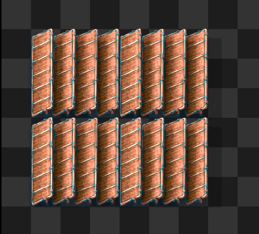
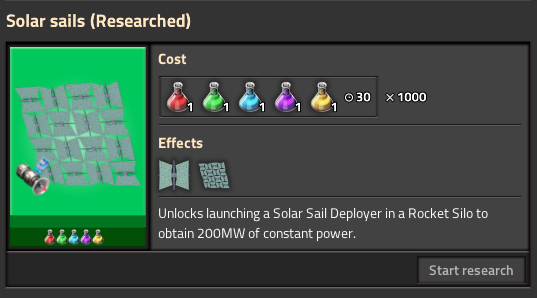

# Solar Sails

This is a Factorio mod for deployable solar sails.

## Design

This mod was intended as a solution to end game UPS issues. There is a high startup cost but once deployed the solar sails will provide a constant 200MW (configurable) source of power with no maintenance cost.

Solar Sails are built from raw resources, compiled together into a Solar Sail Deployer. Launching this into orbit returns a Solar Sail Power Receiver that can be placed on the ground to generate power.

More than one deployer can be launched at a time (stack size 5) and 5 receivers will be returned.

## Sea Block

While this mod works in vanilla it was designed with Sea Block in mind and has recipes specifically for that. If you'd like to add a recipe list for a different overhaul mod please open an issue or PR.

